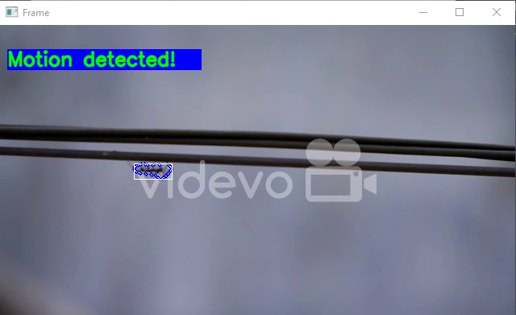
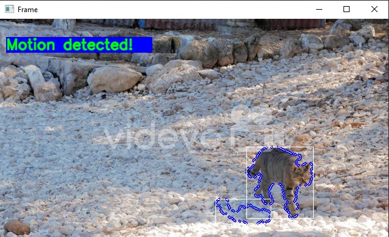

# Motion Detection and Tracking System
> Detect motion live from a video feed


## Table of Contents
- [Motion Detection and Tracking System](#motion-detection-and-tracking-system)
  - [Table of Contents](#table-of-contents)
  - [General Information](#general-information)
  - [Technologies Used](#technologies-used)
  - [Features](#features)
  - [Screenshots](#screenshots)
  - [Setup](#setup)
  - [Usage](#usage)
  - [Project Status](#project-status)
  - [Contact](#contact)

## General Information
A project based on detecting and tracking human/animal/object  using background
subtraction. This system uses computer vision techniques like background substraction,
object detection, and tracking to monitor. This can be used in surveillance and security system,
to alerts the user or police when motion is detected.


## Technologies Used
- Python
- OpenCV


## Features
- Detect and track motion of humans
- Detect and track motion of animals
- Detect and track motion of objects


## Screenshots




## Setup
- It is required to have python already installed.


## Usage
```
git clone
cd (directory of repo)
pip install -r requirements.txt
python main.py
```
- External libraries used are listed in requirements.txt file


## Project Status
Project is: _complete_


## Contact
Created by [@EmmanuelSamuel](samuelmayowaemmanuel@gamil.com) - feel free to contact me!
